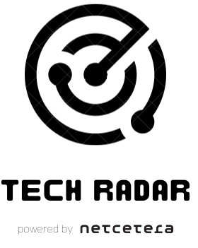

# Tech Radar



Netcetera - Code Camp Fall 2022

Remix - full stack web framework
## What's in the stack

- Email/Password Authentication with [cookie-based sessions](https://remix.run/docs/en/v1/api/remix#createcookiesessionstorage)
- Database ORM with [Prisma](https://prisma.io)
- Styling with [Tailwind](https://tailwindcss.com/)
- Static Types with [TypeScript](https://typescriptlang.org)

## Development

- This step only applies if you've opted out of having the CLI install dependencies for you:

  ```sh
  npx remix init
  ```

- Initial setup: _If you just generated this project, this step has been done for you._

  ```sh
  npm run setup
  ```

- Start dev server:

  ```sh
  npm run dev
  ```

This starts your app in development mode, rebuilding assets on file changes.

The database seed script creates a users with some data you can use to get started:

User (example): 
- Email: `andrejAndStasha@remix.run`
- Password: `1234567`

### Relevant code:

This is a simple tech radar app.
- creating users, and logging in and out [./app/models/user.server.ts](./app/models/user.server.ts)
- user sessions, and verifying them [./app/session.server.ts](./app/session.server.ts)
- adding exciting techs to the radar, editing and tracking their progress.
